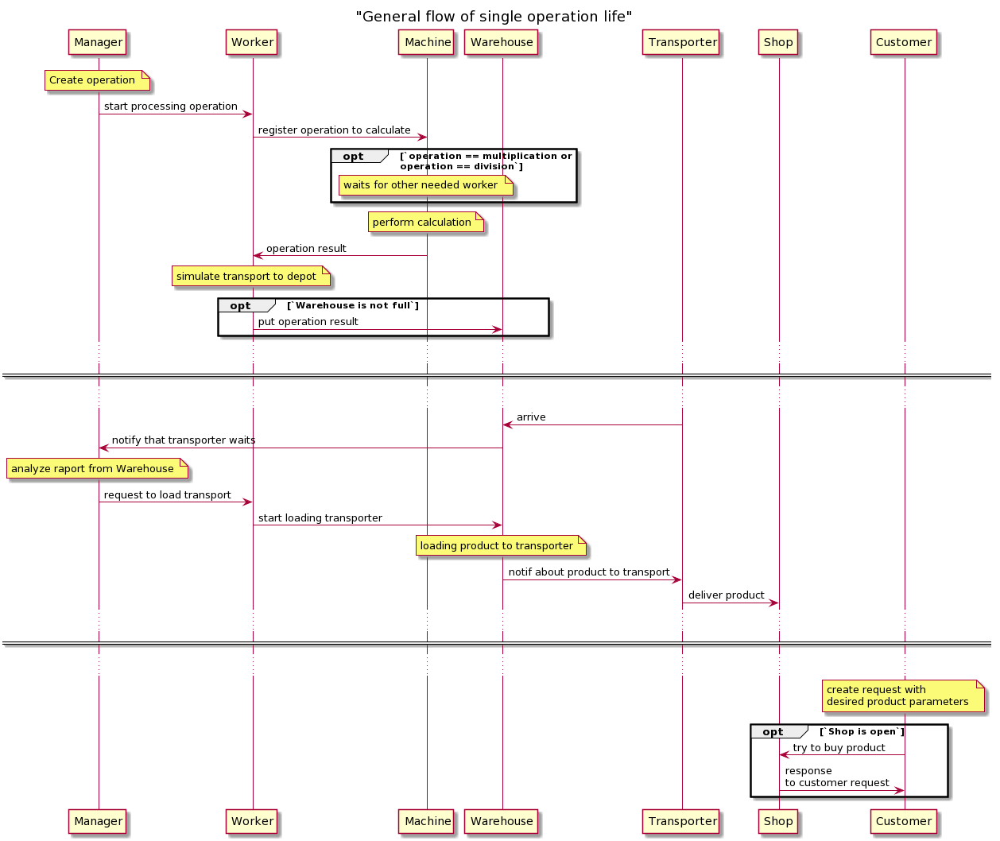
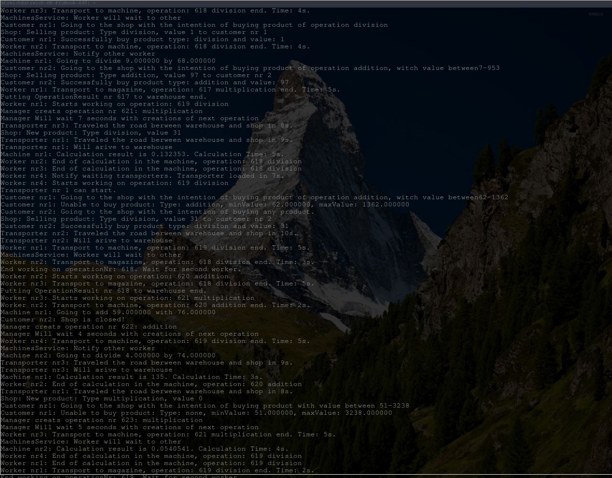

# Factory simulation

### Introduction
The project is a simulation of an abstract factory that produces results of basic mathematical operations. Most of the factory components are represented as separate threads that communicate with each other. There are several bottlenecks that require proper thread management. The simulation includes basic stages of the factory's work, such as production, transport and sale.

### Used tools
Concurrency design patterns like thread pool, mutex and thread queue were used to obtain correct and secure communication between threads. The app also uses features of C++ standard thread library like promise/future, condition variable, mutex and atomics.

### Assumptions 
- One manager thread that radnomly creates maths operations to calculate.
- Possible operation types: addition, substraction, multiplication, division
- Operations are calculated in special machines operated by workers
- Number of machines is limited
- To perform multiplication and division operations two workers are needed
- Time of every type of work and tasks takes is randomize
- After calculation, result of operation is stored and then transported for sale
- Space for storing operations is limited

### Solution description

Factory components and their responsability:
- Manager - thread responsible for creation of mathematical operation in different time intervals. Distributes tasks to workers
- Workers - threads that perform requested by manager. Can operate machines during calculation, load transporters and put operations results into warehouse
- Machines - pool of threads that calculate operation
- Transporters - pool of threads that is responsible for transport of the products of calculations from warehouse to shop
- Warehouse - stores operations results and waites transporters
- Shop - handles deliveries from Warehouse, sales products 
- Customers - pool of threads that buy different products from shop in various time intervals

The user can request to stop the application at any time. Graceful shutdown with waiting for end of each thread's action is performed.

### Setup
Requirements to run project:
- cmake tool
- at least GCC 7 compiler with support of C++17 features

Simulation does not have UI, so it is presented only as an output in consol logs.
Example output:

### Project status
 `finished`